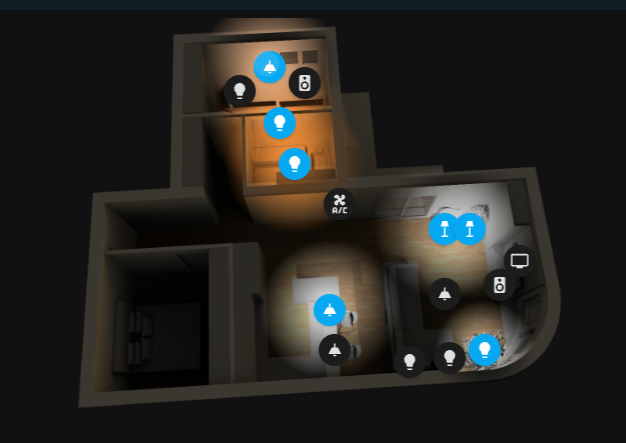
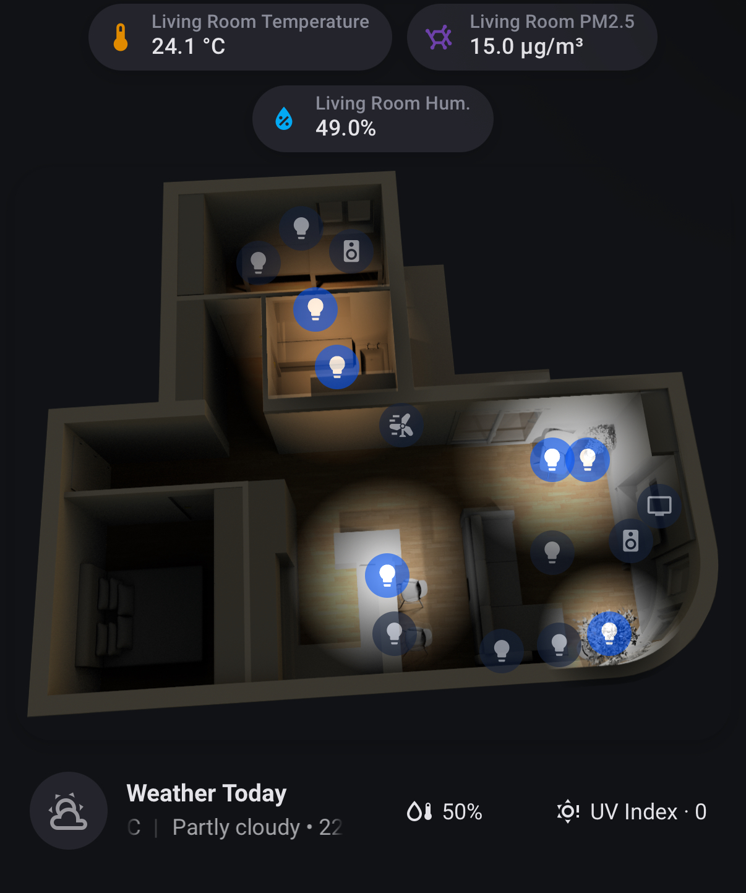

# Apartment View Card

A Home Assistant custom Lovelace card that overlays interactive, state-aware device markers and procedural lighting effects on a 2D/3D floorplan render. Supports pan/zoom and tappable zone focus.

### Example 1 - (desktop)



### Example 2 - (mobile, different configuration - this one is the original React component I am personally using and porting here)



> Screenshots reflect the v2 design. Visual editor and render-free lighting are live in this release.

---

## Headline: Render-Free Lighting

**You need only ONE base render.** Adding a new light or moving an existing one is pure config — no re-rendering.

The card ships three light styles:

| Style | Description | Requires |
|---|---|---|
| `lit` | **Default. Render-free.** Procedurally brightens + tints a patch of the base render using a radial mask. Surface detail is preserved. No extra images needed. | `images.base` only |
| `reveal` | High-fidelity baked look. Reveals the pre-rendered all-lights image inside each light's mask. Reproduces the original v1 multi-render look exactly. | `images.allLights` |
| `glow` | Abstract flat color glow, `screen`-blended. No surface detail. | `images.base` only |

`lit` and `reveal` can be mixed per-entity — for example, use `reveal` for lights present in your original baked render and `lit` for lights added later.

---

## Installation

### HACS (recommended)

1. Open HACS in Home Assistant → Integrations (three-dot menu) → **Custom repositories**.
2. Add `https://github.com/grozdanowski/ha-apartment-view-card` with category **Lovelace**.
3. Install **Apartment View Card** from the HACS frontend section.
4. Add the resource (HACS does this automatically on most installs; if not, see Manual below).

Minimum Home Assistant: **2024.3.0**

### Manual

1. Download `apartment-view-card.js` from the latest release.
2. Copy it to `/config/www/apartment-view-card.js`.
3. Add it to your dashboard resources in **Settings → Dashboards → Resources**:

```yaml
# Or in configuration.yaml:
frontend:
  extra_module_url:
    - /local/apartment-view-card.js
```

---

## Creating the Floorplan Render

The card needs one required image: a **lights-off base render** (`images.base`). All other images are optional.

### Using Sweet Home 3D (free)

1. Download and install [Sweet Home 3D](http://www.sweethome3d.com/).
2. Draw your walls, rooms, furniture, and fixture placements.
3. Set all lights **off** and export → this is your `base` render.
4. *(Optional)* Set all lights to maximum brightness and export → `allLights` (enables the `reveal` style).
5. *(Optional)* Adjust environment for dusk/dawn and export → `duskDawn`.
6. *(Optional)* Adjust environment for night and export → `night`.
7. Upload the images to `/config/www/apartment/` (or any path under `/config/www/`).

**Critical:** every render you create must use the **exact same camera angle and resolution**. The images layer pixel-for-pixel; any mismatch will cause misalignment.

If you skip `night` or `duskDawn`, the card derives them from the base via CSS filters (`brightness(0.4) saturate(0.9)` for night; `brightness(0.75) saturate(1.1) hue-rotate(20deg) sepia(0.15)` for dusk/dawn). These look good for most renders.

---

## Configuration

### Full example

```yaml
type: custom:apartment-view-card
images:
  base: /local/apartment/day.png            # REQUIRED — lights-off render
  allLights: /local/apartment/all-lights.png # optional — enables lightStyle: reveal
  night: /local/apartment/night.png          # optional — else derived from base
  duskDawn: /local/apartment/duskdawn.png    # optional — else derived from base
entities:
  - entity: light.kitchen_ceiling
    name: Kitchen ceiling
    icon: mdi:ceiling-light
    x: 35
    y: 16
    size: small
    tap: toggle
    orientation: null
  - entity: light.living_room_floor
    name: Living room floor lamp
    icon: mdi:floor-lamp
    x: 75
    y: 52
    size: medium
    tap: toggle
    orientation: 200         # directional — cone points roughly south-southwest
    lightStyle: reveal       # per-entity override: use baked render for this light
  - entity: media_player.philips_tv
    name: TV
    icon: mdi:television
    x: 90
    y: 60
    size: medium
    tap: more-info
    orientation: 180         # blue cone projects downward (toward couch)
  - entity: climate.living_room_ac
    name: Living room A/C
    icon: mdi:air-conditioner
    x: 54
    y: 46
    size: small
    tap: none
    orientation: 270         # radar arcs fan left
zones:
  - name: Living room
    icon: mdi:sofa
    x: 52
    y: 44
    width: 43
    height: 50
  - name: Bedroom
    icon: mdi:bed
    x: 5
    y: 5
    width: 45
    height: 48
options:
  view: auto                  # auto | day | night | duskDawn
  lightStyle: lit             # global default: lit | reveal | glow
  freePanZoom: true
  zoomMax: 1.5
  duskDawnOffsetMinutes: 60
```

### `images`

| Key | Required | Description |
|---|---|---|
| `base` | Yes | Lights-off render. The foundation for all light effects. |
| `allLights` | No | All-lights-on render. Required only when any entity uses `lightStyle: reveal`. |
| `night` | No | Night environment render. Derived from `base` if omitted. |
| `duskDawn` | No | Dusk/dawn environment render. Derived from `base` if omitted. |

### `entities[]`

| Key | Default | Description |
|---|---|---|
| `entity` | — | HA entity ID. Any domain: `light`, `media_player`, `climate`, `switch`, etc. |
| `name` | friendly_name | Display name shown on hover / in editor. |
| `icon` | auto | MDI icon. Auto-derived from domain/device_class if omitted. |
| `x` | — | Horizontal position as % of card width (0–100). |
| `y` | — | Vertical position as % of card height (0–100). |
| `size` | `small` | Marker + halo size: `tiny` \| `small` \| `medium` \| `large` \| `huge`. |
| `tap` | `toggle` | Tap action: `toggle` \| `more-info` \| `none`. |
| `orientation` | `null` | Emission direction in degrees (0 = up, clockwise). `null` = omnidirectional. |
| `lightStyle` | `options.lightStyle` | Per-entity override: `lit` \| `reveal` \| `glow`. |

### `zones[]`

| Key | Description |
|---|---|
| `name` | Zone label shown in the chip list below the card. |
| `icon` | MDI icon for the chip. |
| `x` / `y` | Top-left corner of the zone rectangle, as % of card dimensions. |
| `width` / `height` | Zone size as % of card dimensions. |

Zone membership is automatic: an entity belongs to whichever zone rectangle contains its `(x, y)` point. When multiple zones overlap, the smallest by area wins. Entities in no zone are never dimmed during focus.

### `options`

| Key | Default | Description |
|---|---|---|
| `view` | `auto` | Time-of-day mode: `auto` (tracks `sun.sun`) \| `day` \| `night` \| `duskDawn`. |
| `lightStyle` | `lit` | Global light style default: `lit` \| `reveal` \| `glow`. |
| `freePanZoom` | `true` | Enable wheel/drag/pinch pan-zoom in the unfocused overview state. |
| `zoomMax` | `1.5` | Maximum scale cap when zooming to a zone. |
| `duskDawnOffsetMinutes` | `60` | Half-window around sunrise/sunset during which the dusk/dawn view is shown (in `auto` mode). |

---

## Features

### Time of Day

`view: auto` reads `sun.sun` from Home Assistant and switches views automatically:

- **Day** — after sunrise + offset until before sunset − offset.
- **Dusk/Dawn** — within `duskDawnOffsetMinutes` of sunrise or sunset.
- **Night** — outside all the above.

Set `view: day`, `view: night`, or `view: duskDawn` to pin a specific view.

### Directional Emission (Cones)

Any entity with a numeric `orientation` value renders a **directional cone** instead of an omnidirectional halo:

- **Lights** — the `lit`/`reveal`/`glow` mask is clipped to a cone shape (conic-gradient intersected with the radial mask).
- **TV** (`media_player` with TV-like device class) — a soft blue cone glow projecting toward `orientation`; shown only when on.
- **Speaker/radio** (`media_player` audio) — concentric radar arcs fanning into the cone; shown only when playing.
- **A/C** (`climate`) — radar arcs in blue (cooling), red (heating), or gray; shown only when active. Omni when no orientation is set.

Without `orientation` (or `orientation: null`): lights render an omnidirectional radial halo; speakers and A/C render full concentric rings.

### Zones with Tap-to-Zoom

The zone chip list appears below the card. Tapping a chip animates the card to zoom in and center on that zone (0.6s easing) with a subtle **perspective tilt** that gives the room depth (disabled under `prefers-reduced-motion`). While focused:

- Non-focused zones' entity icons dim to 25%.
- A **"← Back to All"** chip appears as the first item in the list.
- Free pan/zoom is disabled (the view is fixed to the zone).
- Press `Escape` or tap "← Back to All" to return to the overview.

### Crisp Icons at Any Zoom

Entity icons live on a **separate, non-transformed overlay** positioned in screen pixels. They do not live inside the pan/zoom layer, so they remain sharp vector SVGs regardless of zoom level. The raster base render softens at high zoom (inherent to raster images); icons do not.

### On-Floorplan Control

Tapping a **controllable** entity (light, media player, climate) opens a compact control surface **below the floorplan** — no dialog, no context switch. The surface is **capability-driven**: it renders only what the specific device actually supports, read live from its attributes.

- **Lights** — brightness slider (if dimmable), a row of colour swatches (if the light supports `rgb`/`hs`/`xy`), and on/off. Colour-only-temperature and on/off-only lights show just what they can do.
- **Media players** — only the transport buttons the device reports (`play`/`pause`, `next`/`previous`), a volume slider (if `VOLUME_SET`), and power.
- **Climate** — a single target-temperature stepper or a low/high range (whichever the device uses), clamped to its real min/max/step, plus its actual `hvac_modes` as chips.

Tapping a **non-controllable** entity performs its configured `tap` action (`toggle`, `more-info`, or `none`). **Press-and-hold** (≥ 450 ms) on any marker opens the native HA more-info dialog. Moving > 8 px before the hold timer fires starts a pan gesture instead.

### Lights Control (multi-select)

The **Lights control** pill (top-right of the floorplan) enters a multi-select mode for driving several lights from one surface:

- Light markers gain checkboxes; non-light markers dim and become non-interactive.
- The control surface opens but stays disabled until at least one light is checked, then drives the whole group at once (group brightness; colour swatches when every selected light supports colour).
- Focusing a zone first pre-checks that zone's lights and scopes selection to it.
- Tap **Done**, press `Escape`, or close the surface to exit.

---

## Visual Editor

The card ships a fully functional `ha-form`-based visual editor (no manual YAML required for most workflows).

**Sections:**
- **Images + Options** — paths for `base`/`allLights`/`night`/`duskDawn`, view mode, light style, pan/zoom settings.
- **Entities** — add, remove, and reorder entities. Per-entity: entity selector (all domains), icon picker, name, size, tap action, orientation toggle + slider (0–359), and X/Y sliders.
- **Zones** — add, remove, and reorder zones. Per-zone: name, icon, X/Y/width/height.

**Live preview:** the editor renders the base image with draggable markers. Dragging a marker updates its X/Y sliders bidirectionally. Selecting a row highlights its marker. Zones can be drawn by dragging a rectangle on the preview (crosshair cursor while drawing; dashed outline while active; solid when complete). Zone rectangles are shown as dashed outlines in edit mode only — they are invisible in normal card view.

---

## Migrating from v1

The v2 config schema is a breaking change. The card automatically normalizes legacy v1 keys via `setConfig`, so pasting old config will not cause silent data loss — but you should update to the v2 schema:

| v1 key | v2 equivalent |
|---|---|
| `objects` | `entities` |
| `entityName` | `entity` |
| `offsetX` / `offsetY` | `x` / `y` |
| `customName` | `name` |
| `customIcon` | `icon` |
| `disableService: true` | `tap: none` |
| `allLightsImage` | `images.allLights` |
| `dayImage` | `images.base` |
| `nightImage` | `images.night` |
| `duskdawnImage` | `images.duskDawn` |

New in v2 (no v1 equivalent): `orientation`, `lightStyle`, `zones`, `options`.

---

## Development

```bash
npm install

# Vite dev server — mounts the card against a mock hass (no live HA needed)
npm run dev

# Unit + component tests (Vitest, happy-dom)
npm run test

# Production build → dist/apartment-view-card.js
npm run build
```

The `dev/` harness serves `dev/index.html` with a hand-written mock `hass` covering `light`, `media_player`, `climate`, and `sun.sun`. A control panel lets you toggle/dim/recolor entities and switch time-of-day. Hot module replacement is enabled.

For occasional real-HA checks, point a `extra_module_url` entry in your HA instance at the Vite dev server, or symlink `dist/` into `config/www/`.

**Testing scope:** component/unit tests run under Vitest with happy-dom. Full-browser screenshot regression (hass-taste-test, Tier 3) is deferred to a future release.

---

## Contributing

Pull requests are welcome. For major changes, open an issue first. Please run `npm run lint` and `npm run test` before submitting.

## License

MIT — see [LICENSE](LICENSE).
